# Superstore 데이터를 통한 상품 유형에 따른 주요 소비자층 분산분석

- Period: 2023/05/01 ~ 2023/06/30
- Tool: R

---

## 분석 배경 및 목적

최근 데이터 수집 경로의 확대와 필요성, CRM의 중요성이 높아지며, 데이터를 활용할 예시를 제공하고자 한다. 이에 최근 4차산업 혁명과 관련하여 개인의 소비에 맞춘 마케팅 전략을 위한 분석을 진행하고자 한다. 또한 일반적인 경제학적 사실과 결합하여, 분석의 정당성을 높이고자 했다.

ifood brain team에서 2020년도에 제공한 Superstore data를 활용하여 최근 2년간 소비되는 일반재와 사치재의 소비량이 고객 특성별로 어떻게 차이가 나는지 파악하고자 실험을 설계했다. 실험은 상기 데이터에서 고객의 연령, 학력, 임금 등 인구통계학적 속성을 설명변수로 사용하여 상품 소비량을 적합하는 것을 목적으로 한다.

## 기대효과

적절한 가정 하에 실험이 성공적으로 이루어졌을 경우, 분석 결과는 추후 해당 기업이 고객 타겟 마케팅이나 프로모션을 진행할 때 마케팅 비용 절감 효과 및 매출 증대 효과를 불러 일으킬 수 있다. 더 나아가 가계 동향 조사 및 대중들의 소비 흐름을 파악하고자 하는 목적의 실험이 있을 경우 이 실험의 분석 결과가 유용하게 쓰일 수 있으리라 기대한다.

## 데이터셋 설명

제공자: Ifood brain team ([https://github.com/nailson/ifood-data-business-analyst-test](https://github.com/nailson/ifood-data-business-analyst-test))

총 데이터수: 2237

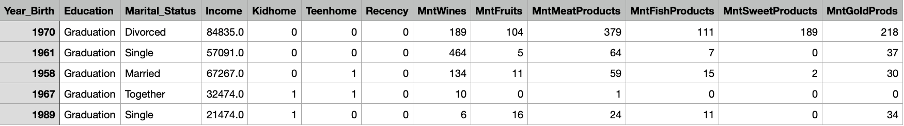

| **Column** | **설명** | **Factors** |
| --- | --- | --- |
| Year_Birth | Age of the customer |  |
| Education | customer's level of education | Graduation, PhD, 2n Cycle, Master, Basic |
| Marital_Status | customer's marital status | 'Divorced', 'Single', 'Married', 'Together', 'Widow', 'YOLO', 'Alone', 'Absurd' |
| Income | customer's yearly household income |  |
| Kidhome | number of small children |  |
| Teenhome | number of teenagers |  |
| Recency | number of days since the last purchase |  |

## 데이터 전처리

본 실험의 목적에 따라, 상품 구매량에 유의미하게 관계가 있는 고객층을 찾기 위해 변수의 선택, 범주화, 그리고 통합을 진행한다. 변수 선택에 앞서, 합리적인 변수 선택을 위해 직관적으로 상품 구매량에 유의미한 관계가 있을 것이라 판단되는 요소를 크게 고객의 소득, 고객의 가정 환경, 고객 개인의 사회적 특징으로 나누었다.

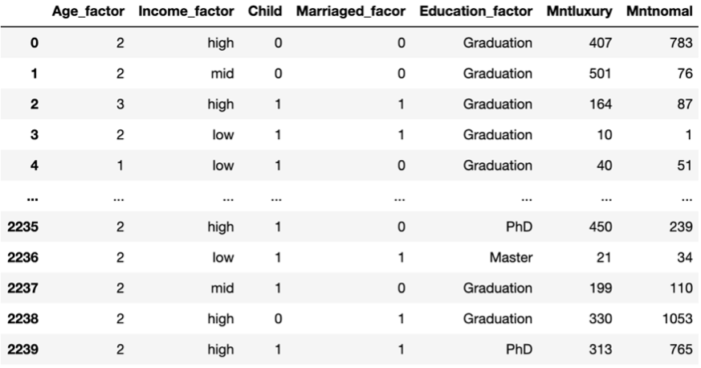

최종 anova table

## EDA
<table>
<tr>
<td width="50%">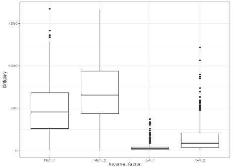</td>
<td width="50%">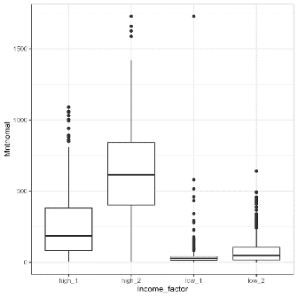</td>
</tr>
<tr>
<td align="center">소득에 따른 사치재 소비량</td>
<td align="center">소득에 따른 일반재 소비량</td>
</tr>
</table>

대체적으로 소득이 높은 고객의 사채지와 일반재 소비량이 더 많은 것을 확인할 수 있다. 소득의 분포는 분위 수 기준으로 잘랐기 때문에 일정하다.
<table>
<tr>
<td width="33%">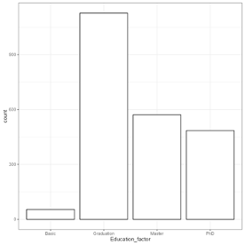</td>
<td width="33%">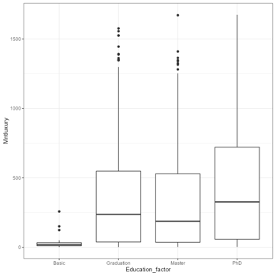</td>
<td width="33%">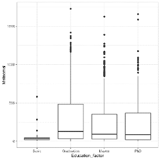</td>
</tr>
</table>

학력의 경우 기초학력자의 비중이 가장 적으며, 학사, 석사, 박사 이상 순으로 비중이 높다. 마찬가지로 독립적으로 보았을 때, 기초학력자 사치재 소비량이 일반적으로 낮은 것을 확인할 수 있다. 반면 일반재의 중앙값은 학력이 높을수록 낮아지는 경향을 보인다.
<table>
<tr>
<td width="33%">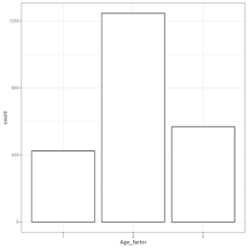</td>
<td width="33%">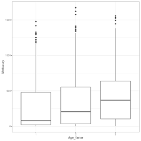</td>
<td width="33%">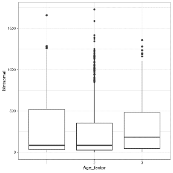</td>
</tr>
</table>

연령 변수는 40~50대가 가장 많은 것으로 보이며, 중앙값을 보았을 때 일반적으로 연령대가 높을수록 사치재 소비가 많은 것으로 보인다.

# 가설 설정 후 ANOVA 시행

### 가설1. 사치재

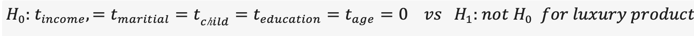

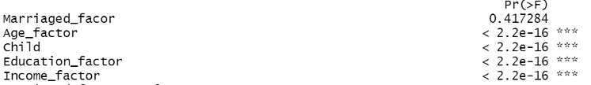

모든 변수와 교호작용을 포함해 검정한 결과, 결혼 상태는 유의수준 0.05 하에서 유의하지 않은 것으로 나타났다.

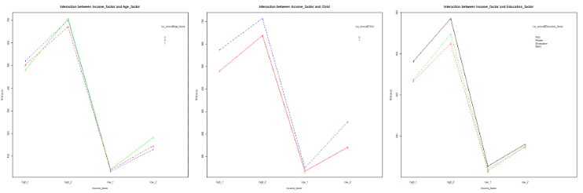

Interaction plot을 통해 실제로 교호작용이 존재하는지 확인한 결과, 유의미한 교호작용은 없는 것으로 보인다.

### 사치재 최종 모델

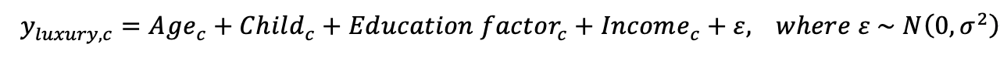

### 결과 해석 및 사후 검정

<table>
<tr>
<td width="50%">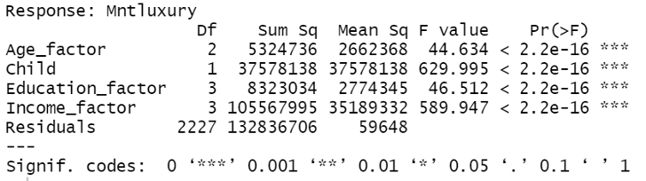</td>
<td width="50%">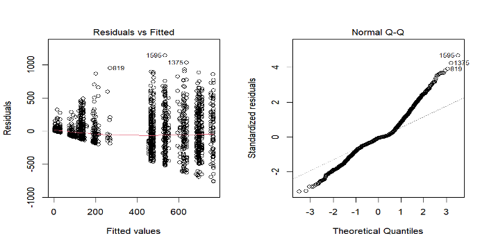</td>
</tr>
<tr>
<td align="center">모델1의 ANOVA Table에서 자녀 유무와 소득이 가장 높은 MSE를 가지는 것으로 나왔다.</td>
<td align="center">모델1의 잔차 plot을 보니 등분산성과 정규성 모두 만족하는 것으로 보인다.</td>
</tr>
</table>

### 가설2. 일반재

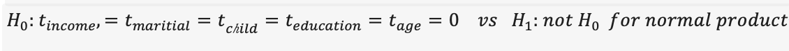

사치재와 마찬가지로 결혼 요인은 유의하지 않다는 결과가 나왔다. 교호작용 검정에서는 ‘소득-교육’, ‘나이-자녀’ , ‘소득-자녀’만이 유의함을 보였다.

### 일반재 최종 모델

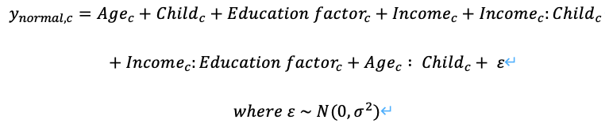

### 결과 해석 및 사후 검정

<table>
<tr>
<td width="50%">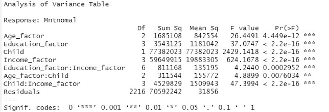</td>
<td width="50%">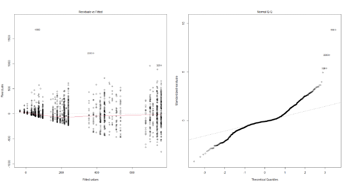</td>
</tr>
<tr>
<td align="center">사치재에서는 관측되지 않던 교호작용이 존재한다. 이는 가정에 사람이 많으니 그만큼 일상생활에 필요한 일반재의 소비가 더 증가하는, 사회적인 직관에 부합한다.</td>
<td align="center">어느 정도 등분산성이 만족하는 것을 확인할 수 있지만, QQ-plot에서는 사치재와 달리 정규성을 따르지 않는 것으로 보인다. 이는 사치재와 달리 일반재의 모델은 선형성에 한계가 있다고 볼 수 있으며, 따라서 모델2의 신뢰도는 모델1에 비해 떨어진다고 볼 수 있다.</td>
</tr>
</table>

## 결론 및 마케팅 전략 제안

1) 모델 1,2 모두 income, child의 MSE가 대부분의 변동을 차지한다.

2) income 소득이 일반재, 사치재에 미치는 영향의 정도가 각각 다르다.

소비의 소득탄력성 관점에서 우리가 사치재에서 기대한 영향과는 다른 결과가 도출되었다. 이는 데이터가 수집된 기업이 음식을 주로 다루는 업체인 점을 고려해 볼 수 있다. 소득이 상위 구간인 소비자의 경우, 굳이 음식을 주로 다루는 기업에서 와인이나 귀금속 같은 품목을 살 필요가 없다. 높은 가격에 소비를 하더라도, 와인 전문점 혹은 레스토랑이나 귀금속 전문점에서 살 유인이 충분히 존재하기 때문에 고소득층에서 높은 소득탄력성을 보이지 않은 것으로 보인다.

따라서, 우리의 직관과는 반대로 데이터의 제공자인 IFood 기업은 사치재의 대상을 고소득자 보다 중위 혹은 중상위층의 고객을 대상으로 마케팅 전략을 펼치는 것이 유리할 것으로 보인다.

반면 일반재의 경우 일반적으로 알려진 바와 같이 저소득 구간에서 높은 구매량 차이를 보였고, 고소득 구간으로 갈수록 적을 구매량 차이를 보였다. 

종합하여, 사치재의 경우 중상위 소득의 자녀를 보유한 고객을 중심으로 마케팅을 펼치는 것이 유효할 것으로 보인다. 일반재의 경우 중하위 소득의 자녀를 보유한 고객을 중심으로 마케팅을 펼치는 것이 유효할 것으로 보인다. 하지만 일반재의 경우 모델 분석의 신뢰도가 낮으므로, 결과를 온전히 신뢰할 수 없다. 추후 정확한 분석 결과를 위해서는 추가 데이터 수집이 필요할 것으로 보인다.

